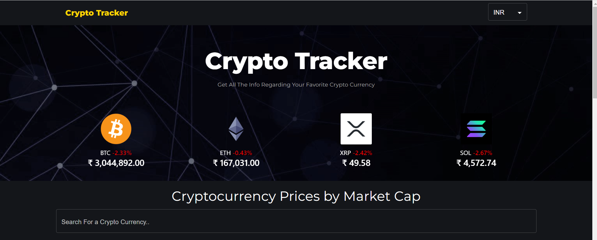
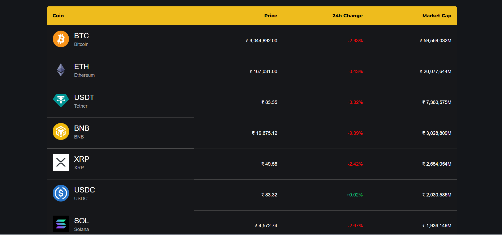
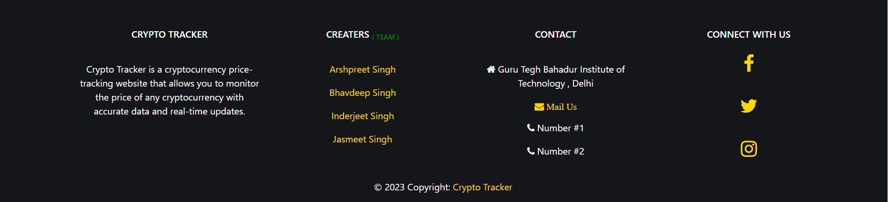
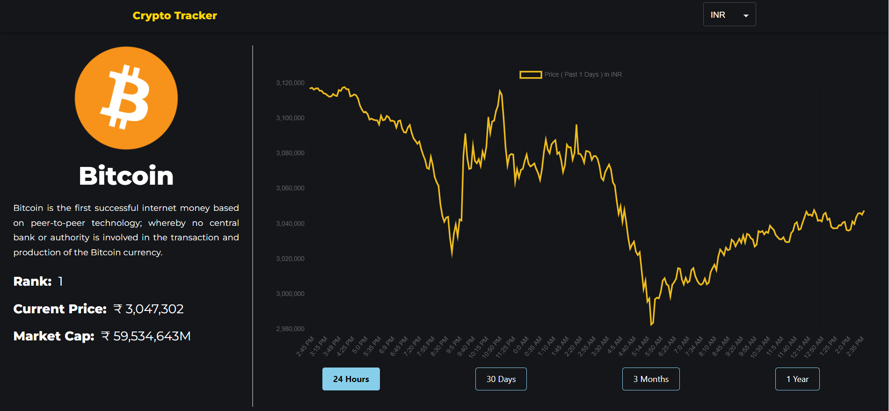

# Crypto Tracker

Crypto Tracker is a cryptocurrency price-tracking website built with React. It allows users to monitor the prices of various cryptocurrencies with accurate data and real-time updates.

## Table of Contents
- [Features](#features)
- [Installation](#installation)
- [Usage](#usage)
- [Folder Structure](#folder-structure)
- [Dependencies](#dependencies)
- [Screenshots](#screenshots)
- [Contributing](#contributing)
- [License](#license)

## Features
- Real-time cryptocurrency price tracking.
- User-friendly interface.
- Responsive design for various devices.

## Installation
To run this project locally, follow these steps:

1. Clone the repository:
   ```bash
   git clone https://github.com/your-username/crypto-tracker.git

2. Navigate to the project directory:
    cd crypto-tracker

3. Install dependencies:
    npm install

4. Start the development server:
    npm run start

## Usage

To use Crypto Tracker, follow these steps:

1. **Homepage:** Upon opening the application, you'll land on the homepage, where you can explore the latest cryptocurrency prices.

2. **More Coins:** Explore a wide range of cryptocurrencies to get detailed information about each.

The application is designed to provide a seamless experience for tracking cryptocurrency prices and managing your portfolio.

## Folder Structure

The project follows a standard React folder structure:

- **`public/`:** Contains the public assets, including the `index.html` file.

- **`src/`:** Contains the source code for the React application.

  - **`components/`:** Holds React components used throughout the application.

  - **`App.js`:** The main component that orchestrates the application.

  - **`index.js`:** The entry point for rendering the React app.

- **`package.json`:** Specifies project dependencies, scripts, and metadata.

- **`README.md`:** Documentation file for users and developers.

## Dependencies

The project relies on the following main dependencies:

- **React:** `v18.2.0` - A JavaScript library for building user interfaces.

- **React Router DOM:** `v5.2.0` - A standard library for routing in React.

- **Bootstrap:** `v4.6.2` - A popular CSS framework for building responsive and mobile-first websites.

- **Material-UI Core:** `v4.12.4` - A React UI framework for designing modern user interfaces.

- **Material-UI Lab:** `v4.0.0-alpha.60` - Additional Material-UI components.

- **Axios:** `v1.6.2` - A promise-based HTTP client for making API requests.

- **Chart.js:** `v3.5.1` - A JavaScript library for creating interactive charts.

- **React Chartjs 2:** `v3.0.4` - A React wrapper for Chart.js.

- **React Alice Carousel:** `v2.5.1` - A React component for a responsive carousel.

- **React HTML Parser:** `v2.0.2` - A utility for parsing HTML strings into React elements.

- **web-vitals:** `v2.1.4` - A library for tracking web vital metrics.

- **React Scripts:** `v5.0.1` - Configuration and scripts for Create React App.

- **Testing Library Jest DOM:** `v5.17.0` - Utilities for testing DOM elements.

- **Testing Library React:** `v13.4.0` - Utilities for testing React components.

- **Testing Library User Event:** `v13.5.0` - Utilities for simulating user events.

- **Buffer:** `v6.0.3` - A Node.js Buffer API polyfill.


## Screenshots







